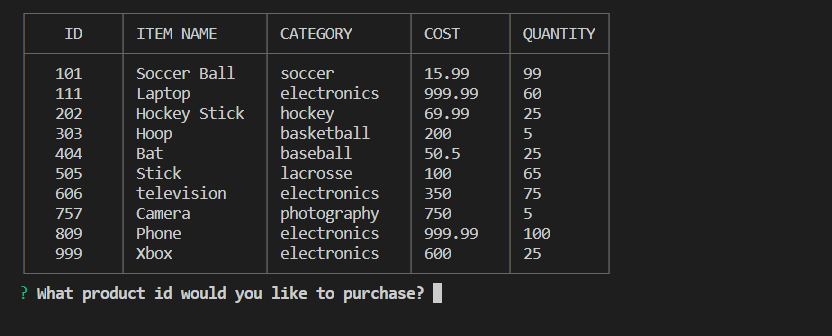
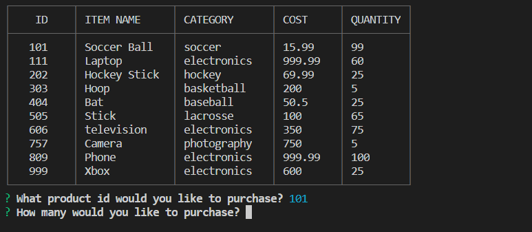
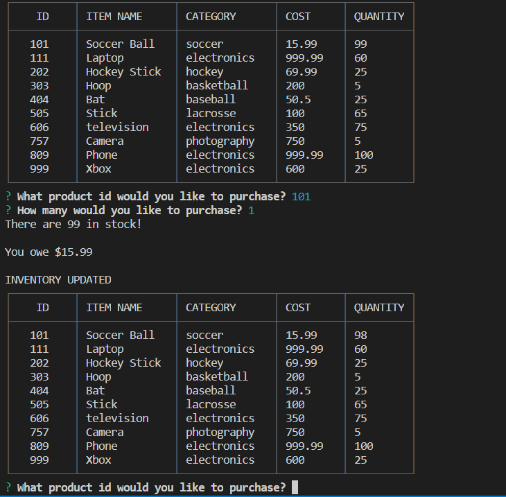
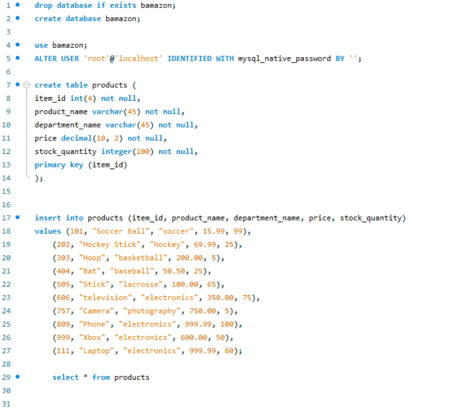

# mysql-week12

## Getting Started

To begin, run the command "node bamazonCustomer.js" in the terminal.
This application will display the current inventory of the Bamazon Marketplace and will prompt initial questions.
The first question will ask about the ID of the item that you would like to purchase. This can be seen in the first screenshot:

## Purchasing an Item

The second prompt will ask the quantity of the item that you are purchasing. This can be seen in the second screenshot:

## Updating the inventory 
 
 Once both prompts are complete, the database will be updated with the new amount of inventory, which can be seen in the third screenshot: 

 

 ## MySQL Database

 This screenshot displays the code within the MySQL workbench that sets up the inventory table:

 